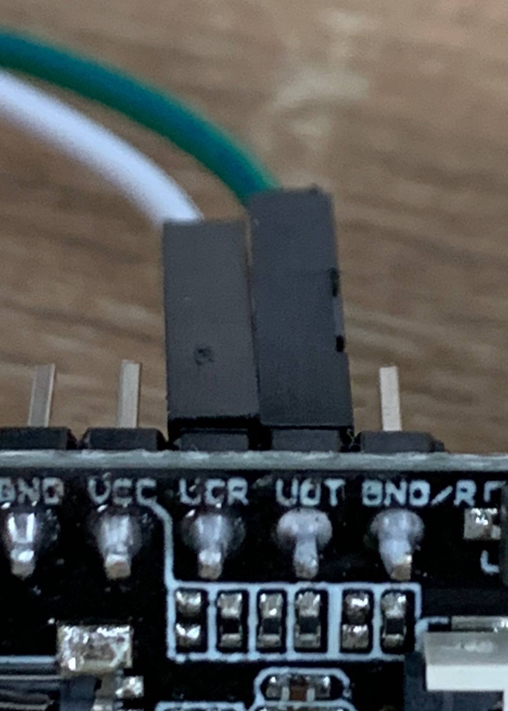
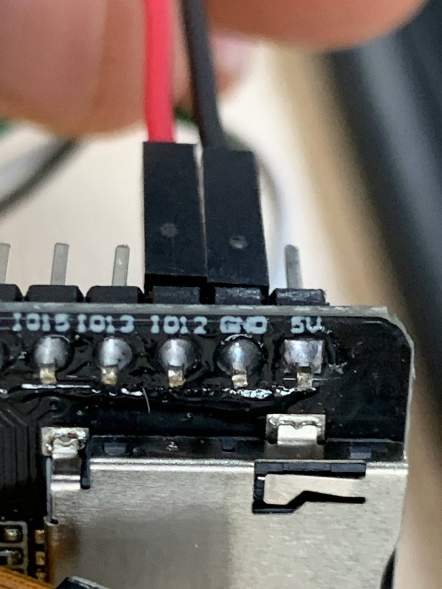

# ESP32-CAM HTTP-стрим с WiFiManager

Прошивка для AI-Thinker ESP32-CAM (или клона на WROOM-32 + OV2640/OV3660). Сборка на базе примера `CameraWebServer` из ESP32 Arduino core 3.3.8 с заменой хардкоженных WiFi-credentials на [tzapu/WiFiManager](https://github.com/tzapu/WiFiManager) — при первом старте поднимается captive portal, сетку выбираешь через браузер.

## Что собиралось

- **Плата**: AI-Thinker ESP32-CAM (клон, WROOM-32 без PSRAM в нашем экземпляре, сенсор OV3660)
- **USB-TTL**: HW-597 (CH340G) — 6-пиновый: `5V | VCC | 3V3 | TXD | RXD | GND`
- **ESP32 Arduino core**: `esp32:esp32@3.3.8`
- **Библиотеки**: `WiFiManager@2.0.17`, `Chirale_TensorFlowLite` (ML-детектор светодиодов)
- **FQBN**: `esp32:esp32:esp32cam`

## Распиновка для прошивки (UART0 + boot-strap)

| Пин USB-TTL | Пин ESP32-CAM | Назначение |
|-------------|---------------|------------|
| 5V          | 5V            | Питание модуля |
| GND         | GND           | Земля |
| TXD         | U0R (GPIO3)   | Команды/прошивка от хоста |
| RXD         | U0T (GPIO1)   | Лог/ответы от модуля |
| `VCC ↔ 3V3` *на самом адаптере* | — | Селектор уровня TX/RX = 3.3V (ESP-safe) |
| **`IO0 ↔ GND`** (только на время прошивки) | — | Вход в download mode |

После заливки **снять перемычку IO0↔GND** и передёрнуть 5V — модуль уйдёт в обычный flash boot.




## Быстрый старт — интерактивный скрипт

Если просто хочешь повторить всё с нуля на новом модуле:

```powershell
git clone git@github.com:mikroNQ/ESP-CAM.git
cd ESP-CAM
.\scripts\setup-esp-cam.ps1
```

Скрипт:

1. Скачает `arduino-cli` в `tools/` (если нет в PATH)
2. Поставит `esp32:esp32@3.3.8` core и `WiFiManager@2.0.17` (если ещё не стоят)
3. Найдёт USB-TTL переходник в системе и спросит какой использовать
4. (Опц.) Прогонит loopback на трёх baud
5. Покажет схему подключения и подождёт подтверждения
6. Откроет serial monitor — проверит, что модуль жив, опознает stock AT firmware
7. Попросит поставить `IO0↔GND`, скомпилирует и зальёт sketch
8. Поймает IP-адрес из вывода WiFiManager после captive portal и предложит открыть в браузере

Опциональные флаги:

```powershell
.\scripts\setup-esp-cam.ps1 -ComPort COM5      # явный порт
.\scripts\setup-esp-cam.ps1 -SkipLoopback      # без проверки адаптера
.\scripts\setup-esp-cam.ps1 -SkipBootCheck     # сразу к прошивке
.\scripts\setup-esp-cam.ps1 -NoBrowser         # не открывать браузер
```

## Сборка и прошивка через arduino-cli вручную

```powershell
# Однократно
arduino-cli config init
arduino-cli config add board_manager.additional_urls https://espressif.github.io/arduino-esp32/package_esp32_index.json
arduino-cli core update-index
arduino-cli core install esp32:esp32@3.3.8
arduino-cli lib install "WiFiManager"
arduino-cli lib install "Chirale_TensorFlowLite"

# Каждый раз
arduino-cli compile --fqbn esp32:esp32:esp32cam CameraWebServer
arduino-cli upload  --fqbn esp32:esp32:esp32cam --port COM30 CameraWebServer
```

Подставь свой COM-порт. На Windows номер можно посмотреть в Диспетчере устройств → Порты (COM и LPT), либо через PowerShell:

```powershell
Get-PnpDevice -Class Ports -PresentOnly | Where-Object FriendlyName -match 'CH340|FTDI|CP210|Prolific'
```

## Первый запуск

1. После прошивки сними перемычку IO0↔GND и передёрни питание.
2. С телефона/ноута найди WiFi-сеть **`ESP32-CAM-Setup`** (без пароля), подключись.
3. Должен открыться captive portal автоматически. Если нет — открой `http://192.168.4.1`.
4. **Configure WiFi** → выбери свою сеть из списка, введи пароль → Save.
5. ESP-CAM сохранит данные в NVS, перезагрузится и подцепится к домашней сети.
6. В Serial Monitor (115200) появится строка вида `Camera Ready! Use 'http://x.x.x.x' to connect`.
7. Открой этот IP в браузере — увидишь интерфейс с потоком и настройками камеры.

## Особенности диагностики (на что напоролись)

- **Stock AT-прошивка** Espressif AT v1.1.2, которая может быть на модуле «из коробки», использует **UART1** для AT-команд (`RX=GPIO16`, `TX=GPIO17`), а **UART0** только для системного лога. На AI-Thinker ESP-CAM GPIO17 не выведен на гребёнки (занят PSRAM-линией), поэтому двусторонняя AT-связь через стандартное подключение к U0R/U0T невозможна. Это объясняет, почему по дефолту бутлог читается, а ответ на `AT` не приходит. Лечится перепрошивкой на родной CameraWebServer (этот репо) или на ESP-AT v2.x, где UART для AT перенастраиваемый. Полный разбор с экспериментальным подтверждением через `AT+RST → SW_CPU_RESET` — в [docs/at-firmware-uart-routing.md](docs/at-firmware-uart-routing.md).
- **HW-597 CH340-модуль**: пин `VCC` — селектор уровня TX/RX, а не питание. Если оставить его в воздухе, драйвер UART не питается и связь не работает ни в одном направлении. Замкнуть джампером/проводком `VCC ↔ 3V3` на самой плате.
- **PL2303 кабели**: клоны блокируются драйвером macOS Big Sur+ (Apple переключилась только на оригинальные Prolific). На Windows встроенный CDC-драйвер всеяден и тот же клон работает.
- **«Hard resetting via RTS pin»** от esptool **физически ничего не делает**, если RTS не разведён до EN на адаптере (на бюджетных кабелях обычно так). После прошивки приходится руками снимать IO0↔GND и передёргивать питание.

## Просмотр потока для нескольких клиентов

Стоковый `/stream` ESP32-CAM держится одним TCP-соединением — второй зритель получает «занято», а сама ESP не вытягивает несколько MJPEG-сессий без артефактов. В каталоге [`relay/`](relay/) лежит маленький Go-сервис на stdlib: открывает к камере одно постоянное соединение и раздаёт кадры произвольному числу клиентов в LAN (fan-out через каналы, медленные клиенты теряют кадры, не блокируя источник). Подробности и сборка — в [`relay/README.md`](relay/README.md).

## Детектор светодиодной линии сканера (on-device ML) + TCP

Камера наводится на сканер штрихкодов (например, Datalogic), у которого пульсирует линия подсветки: красные светодиоды подсветки и белые/статусные. Прошивка прямо на ESP32 крутит крошечную обученную нейросеть (TensorFlow Lite Micro через `Chirale_TensorFlowLite`), которая по вырезанной области кадра классифицирует состояние линии — **`off` / `red_on` / `white_on`** — различая цвета. Машина состояний с дебаунсом замеряет, **сколько длится каждое ON- и OFF-состояние**, и шлёт события по **сырому TCP-сокету** (постоянное соединение) на заданный endpoint в виде построчного JSON (NDJSON).

### Важно про память (нет PSRAM)

Чтобы модель и поток ужились в DRAM без PSRAM, камера переведена в **RGB565 @ QQVGA (160×120)**. Веб-поток `/stream` и `/capture` продолжают работать — кадр кодируется в JPEG на лету (ниже разрешением, чем раньше).

### Формат TCP-событий (NDJSON, по строке на событие)

```json
{"type":"hello","dev":"esp32cam","ip":"192.168.1.50"}
{"ts_ms":123456,"event":"transition","from":"red_on","to":"off","dur_ms":842,"conf":0.97}
{"type":"dropped","count":3}
```

`dur_ms` — длительность состояния `from`, которое только что закончилось (так покрываются и ON-, и OFF-интервалы). `ts_ms` — `millis()` на момент перехода. `dropped` приходит после восстановления связи, если события терялись из-за переполнения очереди.

### Настройка в рантайме — `/detcfg`

Параметры хранятся в NVS и меняются GET-запросом (любой поднабор), ответ — текущая конфигурация JSON:

```
http://<cam-ip>/detcfg?host=<api-ip>&port=9000&enable=1
http://<cam-ip>/detcfg?roi_x=16&roi_y=40&roi_w=128&roi_h=40   # подстроить ROI под линию
http://<cam-ip>/detcfg                                         # просто прочитать текущую конфигурацию
```

Чтобы **прицелиться визуально**, открой `http://<cam-ip>/capture?roi=1` — кадр вернётся с зелёной рамкой текущего ROI поверх изображения. Меняй ROI через `/detcfg` и обновляй страницу, пока рамка не ляжет ровно на линию светодиодов.

Дефолты (endpoint, ROI, частота, дебаунс, размер арены) — в [`CameraWebServer/config.h`](CameraWebServer/config.h). Поля детектора также добавлены в `/status`.

Проверить выход без своего API можно netcat-ом:

```bash
nc -lk 0.0.0.0 9000
# затем: curl "http://<cam-ip>/detcfg?host=<your-ip>&port=9000&enable=1"
```

### Сбор датасета и обучение модели (`ml/`)

В репозиторий закоммичена **bootstrap-модель** (`CameraWebServer/led_model.h`) — со случайными весами: прошивка собирается и весь тракт (тайминги + TCP) работает сразу, но классифицирует мусор, пока не обучишь на реальных кадрах.

**0. Подготовка камеры.** Прошей ESP32-CAM, жёстко зафиксируй её напротив сканера. Подгони ROI ровно по линии светодиодов и **зафиксируй экспозицию** (иначе авто-AGC «подтянет» яркость и `off`/`red` сольются):

```bash
# ROI по линии (сверяйся с http://<cam-ip>/bmp — живой кадр):
curl "http://<cam-ip>/detcfg?roi_x=16&roi_y=40&roi_w=128&roi_h=40"
# фиксируем экспозицию/усиление/баланс белого:
curl "http://<cam-ip>/control?var=aec&val=0"
curl "http://<cam-ip>/control?var=agc&val=0"
curl "http://<cam-ip>/control?var=awb&val=0"
curl "http://<cam-ip>/control?var=aec_value&val=300"   # подбери под свою сцену
```

**1. Снять кадры (авто-разметка по цвету).** `collect.py --auto` снимает потоком и сам раскладывает кропы по `off`/`red`/`white` (сомнительные → `_unsure`):

```bash
cd ml
pip install -r requirements.txt
python collect.py --host <cam-ip> --auto --count 600
```

Пороги эвристики можно подстроить: `--off-v`, `--red-margin`, `--white-min`. Если состояние удобнее снимать вручную — есть режим `--label off|red|white`.

**2. Проверить разметку.** Просмотрщик показывает каждый кроп увеличенным с подсказкой эвристики; клавишами `o/r/w` правишь метку, `d` — удалить. Начни с папки `_unsure`:

```bash
python review.py
```

**3. Обучить и сгенерировать `led_model.h` (int8):**

```bash
python train.py --epochs 30
```

**4. Перекомпилировать и перепрошить** firmware — модель встроена в `led_model.h`.

Вспомогательное: `autolabel.py` — эвристика цвета (общая для collect/review); `make_bootstrap.py` пересоздаёт пустую модель; `convert_to_header.py` конвертит любой `.tflite` в `led_model.h`. Порядок классов и геометрия входа едины в [`ml/model.py`](ml/model.py); ресемплинг при обучении (`Image.BOX`) совпадает с box-усреднением в прошивке.

## Структура

```
CameraWebServer/
├── CameraWebServer.ino    # main: camera init (RGB565/QQVGA) + WiFiManager + сервер + старт детектора
├── app_httpd.cpp          # HTTP-сервер, JPEG-стрим, REST настроек, /detcfg
├── config.h               # дефолты детектора/репортера + ключи NVS
├── led_detector.h/.cpp    # TFLM-инференс по ROI, машина состояний, тайминги
├── tcp_reporter.h/.cpp    # постоянный TCP-сокет, NDJSON, реконнект с backoff
├── led_model.h            # сгенерированная int8-модель (bootstrap; см. ml/)
├── board_config.h         # выбор модели — здесь CAMERA_MODEL_AI_THINKER
├── camera_pins.h          # GPIO-маппинг для всех поддерживаемых плат
├── camera_index.h         # gzip'нутый HTML интерфейса
└── partitions.csv         # 3MB app + OTA, нужно для >2MB прошивки

ml/                        # Python-пайплайн: сбор данных → обучение → led_model.h
├── model.py               # архитектура + int8-квантизация (единый источник правды)
├── autolabel.py           # эвристика цвета для авто-разметки
├── collect.py             # выгрузка ROI с /bmp (--auto / --label)
├── review.py              # Tkinter-просмотрщик для правки меток
├── train.py               # обучение + генерация led_model.h
├── make_bootstrap.py      # пустая модель со случайными весами
├── convert_to_header.py   # .tflite → led_model.h
└── requirements.txt

relay/                     # Go-сервис: MJPEG fan-out на N клиентов (см. relay/README.md)
├── main.go
├── go.mod
└── README.md
```
